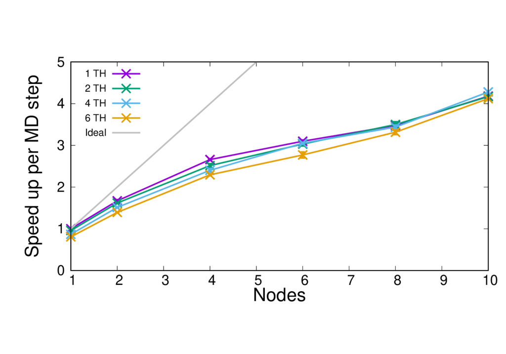

==================================
Running QMMM simulations with CP2K
==================================

---------------------------------
Running a CP2K job
---------------------------------

A standard CP2K build creates multiple executables. It is advised to used the cp2k.psmp
executable as this allows the use of hybrid MPI+OpenMP calculations, which can have some
performance benefit over using MPI only on some machines.

CP2K should be run through a job submission script to run on the compute nodes.
The following command will launch CP2K (MPI only), specifing the input and output files, and the
number of mpi processes.

.. code-block:: none

  export OMP_NUM_THREADS=1
  joblauncher (-n procs) cp2k.pmsp -i inputfile.inp -o outputfile.out

The joblauncher will depend on the job launcher on your system, common examples are
mpiexec, srun and aprun. 

To run with multiple threads (MPI+OpenMP) the number of threads should be set to greater
than 1. Typical values where performance has been seen to be improved over pure MPI are 2, 4, 6, and 8
threads, although this will depend on many things such as your machine, your calcaultion type and
your system of interest. The number of threads to be chosen so that it evenly divides the number
of processes on a node, whilst ensuring that threads sharing memory are in the same NUMA region.
The number of processes will need to be set so that the threads

--------------------------
Performance considerations
--------------------------

A selection of CP2K QMMM benchmarks are available at: https://github.com/bioexcel/qmmm_benchmark_suite

The table below gives an overview of them.

Speed up plots for these on ARCHER are shown below in order to give an idea of a suitable number of cores
to use.

+-----------+---------------------+----------------+-------------+----------------+-----------------+
| Name      | Type                | QM atoms       | Total atoms | XC Functional  | Basis set       | 
+===========+=====================+================+=============+================+=================+
| MQAE      | solute-solvent      | 34             | 16,396      | BLYP	          | DZVP-MOLOPT-GTH | 
+-----------+---------------------+----------------+-------------+----------------+-----------------+
| ClC       | ion channel         | 19, 253        | 150,925     | BLYP	          | DZVP-MOLOPT-GTH |
+-----------+---------------------+----------------+-------------+----------------+-----------------+
| CBD_PHY   | phytochrome         | 68             | 167,922     | PBE            | DZVP-MOLOPT-GTH |
+-----------+---------------------+----------------+-------------+----------------+-----------------+
| GFP_QM    | fluorescent protein | 20, 32, 53, 77 | 28,264      | BLYP           | DZVP-GTH-BLYP   | 
+-----------+---------------------+----------------+-------------+----------------+-----------------+

+---------------+-------+-----------------+-----------------+-----------------+-----------------+---------------------+
| Name     	    | x     | MQAE            | ClC       	    | CIC	          | CBD_PHY    	    | GFP_QM              |
+---------------+-------+-----------------+-----------------+-----------------+-----------------+---------------------+

+---------------+-------+-----------------+-----------------+-----------------+-----------------+---------------------+
| Type          | x     | solute-solvent  | ion channel     | ion channel     | phytochrome     | fluorescent protein |
+---------------+-------+-----------------+-----------------+-----------------+-----------------+---------------------+
| QM atoms      | x	    | 34              | 19	            | 253	          | 68	            | 77                  |
+---------------+-------+-----------------+-----------------+-----------------+-----------------+---------------------+

+---------------+-------+-----------------+-----------------+-----------------+-----------------+---------------------+
| Total atoms   | x     | 16,396	      | 150,925	        | 150,925	      | 167,922	        | 28,264              |
+---------------+-------+-----------------+-----------------+-----------------+-----------------+---------------------+
| XC Functional | x     | BLYP	          | BLYP	        | BLYP	          | PBE             | BLYP                |
+---------------+-------+-----------------+-----------------+-----------------+-----------------+---------------------+
| Basis set     | x     | DZVP-MOLOPT-GTH | DZVP-MOLOPT-GTH | DZVP-MOLOPT-GTH | DZVP-MOLOPT-GTH | DZVP-GTH-BLYP       |
+---------------+-------+-----------------+-----------------+-----------------+-----------------+---------------------+

+---------------+-------+-----------------+-----------------+-----------------+-----------------+---------------------+
| Run time      | 24    | 25.755          |	57.53442        | 352.89425       |	185.36867	    | x                   |
+---------------+-------+-----------------+-----------------+-----------------+-----------------+---------------------+
| x             | 48	| 16.81833	      | 34.4685	        | 282.38286	      | 109.10971	    | 150.7599            |
+---------------+-------+-----------------+-----------------+-----------------+-----------------+---------------------+
| x             | 96	| 12.18783	      | 21.63885        | 238.87591       |	68.35487	    | 103.39486           |
+---------------+-------+-----------------+-----------------+-----------------+-----------------+---------------------+

+---------------+-------+-----------------+-----------------+-----------------+-----------------+---------------------+
| x             | 144	| 10.3228	      | 18.56412	    | 213.3793	      | 53.63196	    | 85.17014            |
+---------------+-------+-----------------+-----------------+-----------------+-----------------+---------------------+
| x             | 192   | 9.90894	      | 16.5546	        | 208.10938	      | 46.06454        | 77.17757            |
+---------------+-------+-----------------+-----------------+-----------------+-----------------+---------------------+
| x             | 240	| 9.85336	      | 13.76657	    | 199.87593	      | 43.44091	    | 72.0526             |
+---------------+-------+-----------------+-----------------+-----------------+-----------------+---------------------+

ClC-19
------

